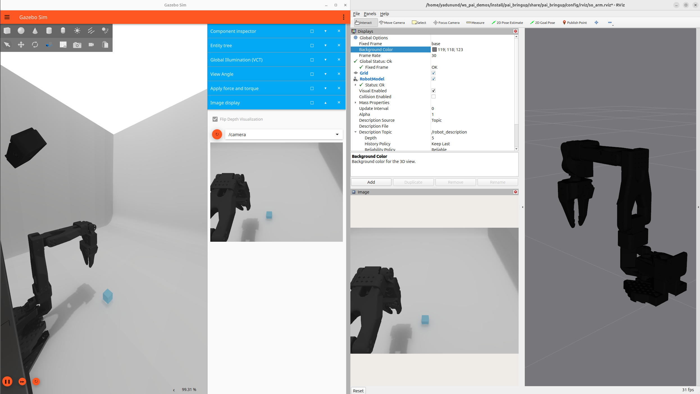
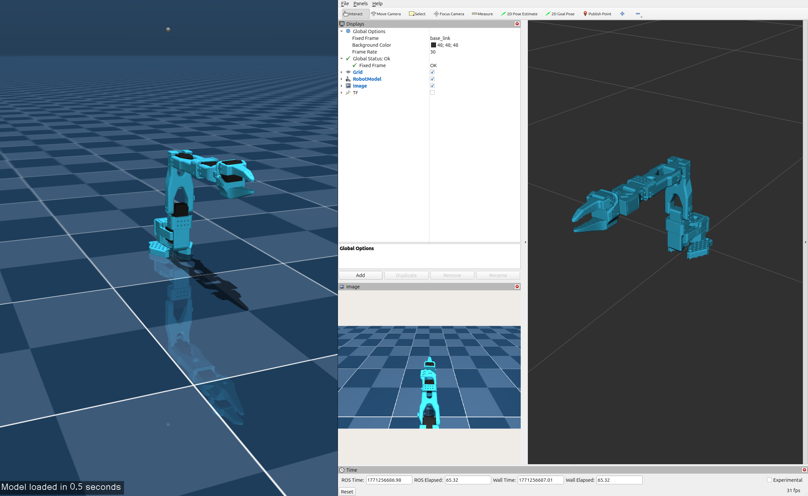

# ROS Physical AI Demos

## Requirements

- [Ubuntu 24.04](https://ubuntu.com/download/desktop)
- [Pixi](https://pixi.sh/latest/installation/) (recommended) — manages ROS 2, Gazebo, and all dependencies automatically
- **NVIDIA GPU** (for ML inference):
  - RTX 5090 (Blackwell): Driver version 570+ and CUDA 12.8+ recommended
  - Other GPUs: Compatible driver and CUDA version
- `libserial-dev` — required by feetech_ros2_driver: `sudo apt install -y libserial-dev`

> [!NOTE]
> ROS 2 `Jazzy Jalisco` is also supported but we recommend `Kilted` to benefit from simulation improvements in `Gazebo Ionic` which pairs with `Kilted` together with improvements in `ros2_control`.

## Install

```bash
git clone https://github.com/ros-physical-ai/demos
cd demos
vcs import external < pai.repos --recursive
pixi install
pixi run build
```

To install ML dependencies (PyTorch, LeRobot — automatically detects your GPU):

```bash
pixi run install-ml-deps
```

See [DEVELOPMENT.md](./docs/DEVELOPMENT.md) for the full Pixi-based development workflow.

<details>
<summary><strong>Alternative: manual install without Pixi</strong></summary>

If you prefer a system-wide ROS 2 installation:

```bash
sudo apt update && sudo apt upgrade -y
sudo apt install -y libserial-dev python3-vcstool
mkdir ~/ws_pai/src -p && cd ~/ws_pai/src
git clone https://github.com/ros-physical-ai/demos
cd demos
vcs import external < pai.repos --recursive
cd ~/ws_pai
rosdep install --from-paths src --ignore-src --rosdistro kilted -yir
source /opt/ros/kilted/setup.bash
colcon build --cmake-args -DCMAKE_BUILD_TYPE=Release
```

When using this approach, source the workspace before running demos:

```bash
source ~/ws_pai/install/setup.bash
```

</details>

> [!NOTE]
> This project uses [rmw_zenoh](https://github.com/ros2/rmw_zenoh) as the default ROS 2 middleware.
> When using Pixi, this is configured automatically. For manual installs, install it via
> `sudo apt install ros-kilted-rmw-zenoh-cpp` and `export RMW_IMPLEMENTATION=rmw_zenoh_cpp`.
> Ensure the Zenoh router is running: `ros2 run rmw_zenoh_cpp rmw_zenohd` (or `pixi run start_zenoh`).

## Packages

### This repository

| Package                 | Description                                                                                                                                                    |
| ----------------------- | -------------------------------------------------------------------------------------------------------------------------------------------------------------- |
| **pai_bringup**         | Main bringup package — launches the SO-ARM101 or UR5e in Gazebo, MuJoCo, or on real hardware with ros2_control, RViz, camera bridge, and optional LeRobot inference    |
| **pai_leader_teleop**   | Leader-follower teleoperation — brings up a physical leader SO-ARM101 to control a follower arm via ros2_control                                               |
| **pai_data_collection** | Configuration and scripts for collecting demonstration datasets via the Rosetta ROS 2–LeRobot bridge                                                           |
| **pai_description**     | Scene-level SDF world definitions — single source of truth for both Gazebo (loaded natively) and MuJoCo (converted to MJCF at launch time via `sdformat_mjcf`) |
| **pai_assets**          | Shared 3D model assets (meshes, textures) used by the demo scenes                                                                                              |

### External (imported via `pai.repos`)

| Source                                                                                                            | Description                                                                           |
| ----------------------------------------------------------------------------------------------------------------- | ------------------------------------------------------------------------------------- |
| [ros2_so_arm](https://github.com/JafarAbdi/ros2_so_arm)                                                           | URDF descriptions, MoveIt config, Gazebo support, and utilities for the SO-ARM robots |
| [feetech_ros2_driver](https://github.com/legalaspro/feetech_ros2_driver)                                          | ros2_control hardware interface for Feetech servo motors                              |
| [mujoco_ros2_control](https://github.com/ros-controls/mujoco_ros2_control)                                        | ros2_control integration with the MuJoCo physics simulator                            |
| [rosetta](https://github.com/iblnkn/rosetta) / [rosetta_interfaces](https://github.com/iblnkn/rosetta_interfaces) | ROS 2–LeRobot bridge for recording demonstration datasets                             |
| [lerobot-robot-rosetta](https://github.com/iblnkn/lerobot-robot-rosetta)                                          | LeRobot Robot plugin for Rosetta — bridges ROS 2 topics to LeRobot's Robot interface  |
| [Universal_Robots_ROS2_Description](https://github.com/UniversalRobots/Universal_Robots_ROS2_Description)          | UR5e URDF, meshes, and per-variant configuration (v4.3.0)                              |

## Launching the SO-ARM101

### Gazebo



```bash
ros2 launch pai_bringup so_arm_gz_bringup.launch.py
```

With Pixi: `pixi run so-arm-gz`

### MuJoCo



```bash
ros2 launch pai_bringup so_arm_mujoco_bringup.launch.py
```

With Pixi: `pixi run so-arm-mujoco`

### Real hardware

```bash
ros2 launch pai_bringup so_arm_real_bringup.launch.py
```

With Pixi: `pixi run so-arm-real`

#### Configuring the real robot

##### Servo calibration

Each SO-ARM101 must be calibrated before use so that encoder zero aligns with the expected physical pose. Calibration writes a `homing_offset` to each servo's EEPROM via LeRobot's calibration tool. After calibration, sending **0 rad** to any joint moves it to its calibrated center.

See the full [Calibration Guide](./docs/calibration_guide.md) for step-by-step instructions, optional `joint_config_file` usage, and known limitations (e.g. gripper normalization differences between LeRobot and ROS 2).

##### Cameras

The real-robot bringup launches a **wrist camera** and a **static camera** by default using [usb_cam](https://github.com/ros-drivers/usb_cam). Both publish at 640×480 @ 30 fps:

| Topic                      | Frame                | Device            |
| -------------------------- | -------------------- | ----------------- |
| `/wrist_camera/image_raw`  | `wrist_camera_link`  | `/dev/cam_wrist`  |
| `/static_camera/image_raw` | `static_camera_link` | `/dev/cam_static` |

> [!IMPORTANT]
> [Udev rules](#udev-rules) must be configured before using cameras on real hardware. Without them, `/dev/cam_wrist` and `/dev/cam_static` will not exist and the camera nodes will fail to start.

Each camera has its own driver-parameter file (`usb_cam_wrist.yaml`, `usb_cam_static.yaml`) so you can tune resolution, framerate, or pixel format independently — useful when the two cameras are different models.

> [!NOTE]
> A default camera-calibration file ([`default_640x480.yaml`](pai_bringup/config/cameras/default_640x480.yaml)) is shipped so that RViz Camera displays work without errors. It is **NOT** required for policy training or inference — the policy consumes raw pixel observations and joint-position actions, so camera intrinsics (focal length, principal point, distortion coefficients) never enter the learning or inference pipeline. We publish `camera_info` with placeholder intrinsics for standard ROS tooling (e.g. RViz, image_proc), not for LeRobot. If you need accurate intrinsics (e.g. for 3D reconstruction), replace the default file with a proper calibration via `ros2 run camera_calibration cameracalibrator` or your tool of preference.

Camera frames are defined in [`pai_bringup/urdf/cameras.xacro`](pai_bringup/urdf/cameras.xacro) and published to TF by `robot_state_publisher`. The wrist camera moves with the gripper; the static camera is fixed relative to `base_link`.

To disable cameras:

```bash
ros2 launch pai_bringup so_arm_real_bringup.launch.py use_cameras:=false
```

The static camera position and orientation can be overridden at launch time to match your physical mounting:

```bash
ros2 launch pai_bringup so_arm_real_bringup.launch.py \
    cam_static_xyz:="0.0 0.0 0.50" \
    cam_static_rpy:="3.6652 0.0 -1.5708"
```

> [!NOTE]
> In simulation (Gazebo / MuJoCo), the same two cameras are rendered by the simulator and bridged to the same ROS topics. Camera TF frames come from the same `cameras.xacro`.

> [!NOTE]
> [gscam](https://github.com/ros-drivers/gscam) (GStreamer) offers better timestamp fidelity but is not available from robostack and must be compiled from source.

##### Udev rules

Stable device symlinks (`/dev/cam_wrist`, `/dev/cam_static`) prevent cameras from swapping after a reboot. See [pai_bringup/config/hardware/99-so-arm101-cameras.rules.example](pai_bringup/config/hardware/99-so-arm101-cameras.rules.example) for setup instructions.

### Leader arm teleoperation

You can use a leader SO-ARM101 to teleoperate the follower arm (sim or real):

```bash
ros2 launch pai_leader_teleop leader_bringup.launch.py
```

With Pixi: `pixi run so-arm-leader`

## Demos

### End-to-End Learning Pipeline with SO-ARM

Record demonstrations, train a policy, and deploy it on the robot — in simulation or on real hardware, using any input method (leader arm teleoperation, scripted commands, or custom controllers).

#### Recording episodes

<table>
<tr>
<td align="center"><b>Simulation</b></td>
<td align="center"><b>Real Hardware</b></td>
</tr>
<tr>
<td>

https://github.com/user-attachments/assets/9bd16f15-358f-44e2-80f8-df01aaca47c0

</td>
<td>

https://github.com/user-attachments/assets/bcc907b0-0914-43be-89ee-5bd161139264

</td>
</tr>
<tr>
<td align="center"><em>Recording episodes in Gazebo via leader arm teleoperation</em></td>
<td align="center"><em>Recording episodes on real SO-ARM101</em></td>
</tr>
</table>

#### Trained policy inference

<table>
<tr>
<td align="center"><b>Simulation</b></td>
<td align="center"><b>Real Hardware</b></td>
</tr>
<tr>
<td>

https://github.com/user-attachments/assets/9183df05-4db4-46b4-90ef-56cfd50b56c2

</td>
<td>

https://github.com/user-attachments/assets/51beafa7-4d85-4a53-b0db-ec593f663850

</td>
</tr>
<tr>
<td align="center"><em>Trained policy running in Gazebo</em></td>
<td align="center"><em>Trained policy running on real SO-ARM101</em></td>
</tr>
</table>

> [!NOTE]
> These videos show an **ACT** policy trained on the recorded episodes. The goal here is to demonstrate the full **Record → Train → Deploy** pipeline — not to showcase optimal policy performance, which depends on the number of episodes, model selection, and hyperparameter tuning.

For the full pipeline guide see [End-to-End Learning Pipeline with Rosetta](./demos/so_arm_101/rosetta_end_to_end_demo.md).

## UR5e Industrial Robot Support (Phases A + B)

This repository also supports the **UR5e** industrial arm from
Universal Robots in Gazebo, sharing the same Record → Train → Deploy
pipeline as the SO-ARM101. Phase A drives the 6 UR joints with a
standard `forward_position_controller`, mirroring the SO-ARM101 setup.
Phase B adds three wrist-mounted cameras (left / center / right) so a
policy can be trained on visual observations.

### Robot Configuration

| Component | Details |
|---|---|
| Arm | Universal Robots UR5e (6 joints) |
| Gripper | Not yet integrated |
| Cameras | 3 × wrist-mounted (`wrist_left_camera`, `wrist_center_camera`, `wrist_right_camera`), 640×480 @ 30 Hz |
| Force/Torque | Not yet integrated |
| Simulation | Gazebo (gz sim) |

### Launching the UR5e

#### Gazebo

```bash
ros2 launch pai_bringup ur5e_gz_bringup.launch.py
```

With Pixi: `pixi run ur5e-gz`

The launch spawns:
- `robot_state_publisher` (UR5e URDF from `ur_description` + wrist camera frames),
- `gz sim` with the `pai_description` empty-ground world,
- the UR5e robot model with three wrist-mounted gz camera sensors,
- `joint_state_broadcaster` and `forward_position_controller`,
- a `ros_gz_bridge` exposing `/clock`, `/wrist_{left,center,right}_camera/image_raw`, and `/wrist_{left,center,right}_camera/camera_info`,
- and (optionally) RViz with the upstream UR view config.

Wrist cameras can be disabled at launch time:

```bash
ros2 launch pai_bringup ur5e_gz_bringup.launch.py enable_wrist_cameras:=false
```

#### Manual joint move

```bash
ros2 topic pub --once /forward_position_controller/commands \
  std_msgs/msg/Float64MultiArray \
  '{data: [0.0, -1.2, 1.5, -1.5, -1.5, 0.0]}'
```

#### Recording Episodes

```bash
ros2 launch rosetta episode_recorder_launch.py \
    contract_path:=$(ros2 pkg prefix pai_data_collection)/share/pai_data_collection/config/rosetta/ur5e.yaml \
    bag_base_dir:=datasets/ur5e_gz/bags
```

With Pixi: `pixi run ur5e-rosetta-record`

### Pipeline

```
Recording → rosetta episode_recorder → rosbag → LeRobot dataset
Training  → lerobot-train (ACT, SmolVLA, ...)
Deploy    → rosetta_client (Float64MultiArray) → forward_position_controller
                                                     ↓
                                               UR5e in Gazebo
```

### Future work

F/T sensor support, a Robotiq Hand-E gripper, and Cartesian/joint
impedance control are tracked in [`aic_plan.md`](./aic_plan.md)
(remaining Phase B item B.8 and Phase C). They are not yet implemented.

### Dependencies

UR5e support depends on
[`Universal_Robots_ROS2_Description`](https://github.com/UniversalRobots/Universal_Robots_ROS2_Description)
v4.3.0, imported automatically via `pai.repos`.

## Linting & Pre-commit

This repository uses [pre-commit](https://pre-commit.com/) to enforce consistent code quality. The following hooks are configured:

- **General**: trailing whitespace, end-of-file fixer, YAML/XML validation, large file check, merge conflict markers
- **Python**: [Ruff](https://docs.astral.sh/ruff/) for linting and formatting
- **Shell**: [ShellCheck](https://www.shellcheck.net/) for static analysis
- **YAML/Markdown**: [Prettier](https://prettier.io/) for formatting
- **CMake**: [cmake-lint](https://cmake-format.readthedocs.io/) for CMakeLists.txt files

### Setup

Install the git hooks so they run automatically on every commit:

```bash
pre-commit install
```

With Pixi: `pixi run -e default pre-commit install`

### Usage

Hooks will run automatically on staged files when you `git commit`. To run all hooks on all files manually:

```bash
pre-commit run --all-files
```

With Pixi: `pixi run lint`

## External demos

Other demos: fully open-source physical AI projects on ROS.

- [Agentic mobile manipulator](https://github.com/RobotecAI/agentic-mobile-manipulator), a comprehensive demo project using a hardware-in-the-loop setup with O3DE and all the software and inference running on-board.
