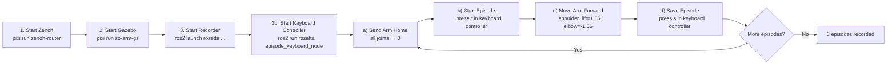

# End-to-End Learning Pipeline with Rosetta

This guide explains the full Record → Train → Deploy pipeline using [Rosetta](https://github.com/iblnkn/rosetta) and [LeRobot](https://github.com/huggingface/lerobot). Rosetta bridges ROS 2 and LeRobot by defining a **contract** that maps ROS 2 topics to LeRobot features — replacing custom recording and replay scripts with a standardized, task-agnostic pipeline.

```
  ┌──────────┐     ┌──────────┐     ┌──────────┐     ┌──────────┐     ┌──────────┐
  │  DEFINE  │     │  RECORD  │     │ CONVERT  │     │  TRAIN   │     │  DEPLOY  │
  │ Contract │────▶│  Demos   │────▶│ Dataset  │────▶│  Policy  │────▶│ on Robot │
  └──────────┘     └──────────┘     └──────────┘     └──────────┘     └──────────┘
```

The pipeline is **not tied to a specific task**. The same workflow applies whether you are teaching the robot to pick and place objects, sort items, wave, or perform any other manipulation behavior — only the recorded demonstrations define what the policy learns.

> [!TIP]
> See the [main README](../../README.md#demos) for videos of the full pipeline in action — recording demonstrations via leader arm teleoperation and deploying trained policies, in both simulation and on real hardware.

## Prerequisites

Follow the main [README](../../README.md) to set up the workspace:

```bash
git clone https://github.com/ros-physical-ai/demos && cd demos
vcs import external < pai.repos --recursive
pixi install
pixi run install-ml-deps   # PyTorch + LeRobot (auto-detects GPU)
pixi run build
```

> [!NOTE]
> All commands below assume you are inside a `pixi shell` session or running via `pixi run`.

---

## Your Options

The repo is designed to be flexible — you can mix and match backends, input methods, and policies depending on your setup and goals:

| Dimension         | Options                                                                                                                                        |
| ----------------- | ---------------------------------------------------------------------------------------------------------------------------------------------- |
| **Robot backend** | **Gazebo** (`pixi run so-arm-gz`), **MuJoCo** (`pixi run so-arm-mujoco`), or **Real hardware** (`pixi run so-arm-real`)                        |
| **Input method**  | **Leader arm teleoperation** (`pixi run so-arm-leader`), scripted `ros2 topic pub` commands, or any custom node publishing to the action topic |
| **Policy type**   | **ACT** (behavior cloning), **SmolVLA** / **Pi0** / **Pi0Fast** (VLAs), **Diffusion** (diffusion policy) — any LeRobot-supported policy        |
| **Application**   | Any manipulation task — pick-and-place, sorting, assembly, pouring, etc. The pipeline is task-agnostic                                         |

All backends publish the **same ROS 2 topics** (`/joint_states`, `/forward_position_controller/commands`, camera image topics), so the Rosetta contract works identically regardless of whether you run in Gazebo, MuJoCo, or on real hardware. You can prototype a task in simulation and later collect real-world demonstrations (or vice versa) without changing the pipeline.

> [!TIP]
> **Leader arm teleoperation** is the recommended input method for real-world data collection. A second physical SO-ARM101 acts as a torque-free leader — you move it by hand, and the follower arm mirrors the motion in real time. Because the leader teleop node publishes to `/forward_position_controller/commands` (the same topic the contract records), the episode recorder captures human demonstrations transparently.

---

## The Pipeline

### 1. The Contract

A Rosetta contract is a YAML file that defines the mapping between ROS 2 topics and LeRobot dataset features. It tells Rosetta what to record, how to convert units, and where to publish actions during inference.

The SO-ARM101 contract lives at `pai_data_collection/config/rosetta/so_arm101.yaml`:

| ROS 2 Side                                                    |     | LeRobot Side                |
| ------------------------------------------------------------- | --- | --------------------------- |
| `/wrist_camera/image_raw` (`sensor_msgs/Image`)               | →   | `observation.images.wrist`  |
| `/static_camera/image_raw` (`sensor_msgs/Image`)              | →   | `observation.images.static` |
| `/joint_states` (`sensor_msgs/JointState`)                    | →   | `observation.state`         |
| `/forward_position_controller/commands` (`Float64MultiArray`) | ←   | `action`                    |

Key contract features:

- **FPS**: 50 Hz (matches the `ros2_control` update rate)
- **Image resize**: `apply: [resize: [480, 480]]` for neural network input
- **Unit conversion**: `apply: [rad2deg]` — automatically converts ROS 2 radians to LeRobot degrees during recording and back during inference
- **Safety behavior**: `channel.safety: hold` — maintains last commanded position when inference stops

You can inspect or modify the contract to fit your robot or sensor configuration. For example, you could add more cameras, change the FPS, or adjust image resolution.

> [!IMPORTANT]
> On an action, `apply` is a **directional** pipeline: recording runs it front-to-back, and inference runs it back-to-front through each operator's inverse. Our action declares `apply: [clamp: {...}, rad2deg]` so that inference runs `deg2rad` and _then_ clamps — bounding the outgoing command in radians. Writing the two in the other order would clamp degrees to ±3.14 and destroy every command. See the [contract reference](https://iblnkn.github.io/rosetta/reference/contract.html#operators).

> [!TIP]
> The contract is validated entirely at load time, so loading it is a complete test of codecs, timelines, operator invertibility, and image geometry:
>
> ```bash
> python -c "from rosetta.contract.schema import load_contract; load_contract('$(ros2 pkg prefix pai_data_collection)/share/pai_data_collection/config/rosetta/so_arm101.yaml'); print('OK')"
> ```

### 2. Recording Episodes

Recording captures rosbags of demonstration episodes through the Rosetta episode recorder. The general flow is:

1. **Start the Zenoh router** — required middleware for ROS 2 communication.
2. **Start the robot** — simulation or real hardware.
3. **Start the episode recorder** — points to the contract and an output directory for bags.
4. **For each episode:**
   a. Reset the scene — send the arm to its home pose. In Gazebo sim, if your task involves the cubes in the `pai_world` scene, you can additionally reset their positions via the [data-collection workflow](../../pai_data_collection/README.md#workflow) helper (`gz_set_cubes_poses.py`, supports `--random` for variety).
   b. Start recording (`r` key in the keyboard controller, or via the `/episode_recorder/record_episode` action).
   c. Perform the task — via leader teleop, scripted commands, or any other method.
   d. Stop recording (`s` to save, `d` to discard and re-record).
5. **Repeat** to collect as many episodes as needed.

The commands:

```bash
# Terminal 1: Start the episode recorder (works with any backend)
# Add use_sim_time:=true for the Gazebo and MuJoCo backends, which publish /clock.
ros2 launch rosetta episode_recorder_launch.py \
    contract_path:=$(ros2 pkg prefix pai_data_collection)/share/pai_data_collection/config/rosetta/so_arm101.yaml \
    bag_base_dir:=<output_directory>

# Terminal 2: Start the keyboard controller
ros2 run rosetta episode_keyboard_node
```

> [!NOTE]
> **The recorder records every topic on the graph**, not just the contract's, so you never lose data you might want to train on later. The contract acts as a _manifest_: its topics are required to be present, and the recorder reports per-topic message counts at episode end and flags contract topics that received nothing. Trim with `record_all:=false` or the `exclude_topics` regex list in `params/episode_recorder.yaml`. Cameras are the exception — the recorder keeps one `image_transport` stream per camera, since republishers encode only while subscribed and recording all of them would make one camera encode every frame several ways at once.

> [!NOTE]
> Episodes are recorded as **raw** rosbag2 messages, with the contract text embedded in each bag's `metadata.yaml`. Decoding, resizing, alignment, and unit conversion all happen at conversion or inference time — so **revising the contract never requires re-recording**. The same bags can produce different datasets as your schema evolves.

Keyboard controls:

| Key       | Action                                |
| --------- | ------------------------------------- |
| `r` / `→` | Start recording                       |
| `s` / `←` | Stop and save                         |
| `d` / `⌫` | Discard episode (stop + delete bag)   |
| `t`       | Edit task prompt for the next episode |

> [!NOTE]
> You can also trigger recording directly via the ROS 2 action interface if you prefer scripted control: `ros2 action send_goal /episode_recorder/record_episode rosetta_interfaces/action/RecordEpisode "{prompt: '<task>'}"`. Stop by pressing `Ctrl+C` on that command.

> [!NOTE]
> The input method doesn't matter to the recorder — anything that publishes to the topics defined in the contract gets captured. Leader arm teleop, scripted commands, MoveIt planning, or a custom controller all work the same way.

#### Verifying a Recorded Episode

After recording, you can replay a rosbag to confirm it was captured correctly before converting or training. This plays back the recorded topics so you can visualize them in RViz or on the robot itself:

```bash
ros2 bag play <path_to_bag_directory>
```

For example, to replay at the original recording rate and inspect topics:

```bash
# List the topics in the bag
ros2 bag info <path_to_bag_directory>

# Play back the bag (robot + cameras will replay)
ros2 bag play <path_to_bag_directory>
```

> [!TIP]
> If the robot backend (Gazebo, MuJoCo, or real hardware) is running, replaying the bag will send the recorded commands to the robot, making it reproduce the demonstration. This is a quick way to spot bad episodes — look for jerky motions, missed grasps, or incorrect camera framing.

### 3. Converting to LeRobot Dataset

After recording, convert the rosbags into a LeRobot dataset using the `rosetta_port` CLI. The contract's `apply: [rad2deg]` is applied automatically during conversion, and `rosetta_port` runs the same resampling code as live inference, so the offline dataset matches what the robot sees at runtime.

```bash
ros2 run rosetta rosetta_port \
    --raw-dir <path_to_bags> \
    --contract $(ros2 pkg prefix pai_data_collection)/share/pai_data_collection/config/rosetta/so_arm101.yaml \
    --repo-id <dataset_name> \
    --root <datasets_directory>
```

> [!NOTE]
> One bag directory is one episode. Observation topics must be present in the bag; actions, rewards, and signals may be missing and will zero-fill. The dataset gets a `meta/rosetta_contract.yaml` sidecar, which is what lets a checkpoint resolve its own contract at deploy time.

> [!TIP]
> Add `--push-to-hub` (with a namespaced `--repo-id`) to upload the converted dataset to the [HuggingFace Hub](https://huggingface.co/datasets) in the same step:
>
> ```bash
> ros2 run rosetta rosetta_port \
>     --raw-dir <path_to_bags> \
>     --contract $(ros2 pkg prefix pai_data_collection)/share/pai_data_collection/config/rosetta/so_arm101.yaml \
>     --repo-id <hf_user>/<dataset_name> \
>     --push-to-hub
> ```
>
> Make sure you are logged in first (`hf auth login`).

#### rosetta_port Arguments

| Argument                        | Required | Description                                                                   |
| ------------------------------- | -------- | ----------------------------------------------------------------------------- |
| `--raw-dir`                     | Yes      | Directory containing bag subdirectories (each with `metadata.yaml`)           |
| `--contract`                    | Yes      | Path to Rosetta contract YAML                                                 |
| `--repo-id`                     | No       | Dataset name. Defaults to the `--raw-dir` directory name                      |
| `--root`                        | No       | Parent directory for datasets. Dataset saved to `root/repo-id`                |
| `--framework`                   | No       | Learning framework to write for (default: `lerobot`, resolved by entry point) |
| `--push-to-hub`                 | No       | Upload to HuggingFace Hub after conversion                                    |
| `--vcodec`                      | No       | Video codec (default: `libsvtav1`). Use `libx264` for faster encoding         |
| `--streaming-encoding`          | No       | Encode frames directly instead of via intermediate PNGs (faster)              |
| `--num-shards`, `--shard-index` | No       | Split the conversion across parallel invocations                              |
| `--no-embed-contract`           | No       | Skip the `meta/rosetta_contract.yaml` sidecar                                 |

### 4. Training a Policy

Train any LeRobot-supported policy on the converted dataset:

```bash
lerobot-train \
    --dataset.repo_id=<dataset_name> \
    --dataset.root=<datasets_directory>/<dataset_name> \
    --policy.type=<policy_type> \
    --output_dir=outputs/train/<run_name> \
    --job_name=<run_name> \
    --policy.device=cuda
```

To resume from a checkpoint:

```bash
lerobot-train \
    --config_path=outputs/train/<run_name>/checkpoints/last/pretrained_model/train_config.json \
    --resume=true
```

> [!TIP]
> You can train directly from a dataset hosted on the [HuggingFace Hub](https://huggingface.co/datasets) (drop `--dataset.root`) and push the trained policy back to the Hub with `--policy.push_to_hub=true` and a namespaced `--policy.repo_id`:
>
> ```bash
> lerobot-train \
>     --dataset.repo_id=<hf_user>/<dataset_name> \
>     --policy.repo_id=<hf_user>/<run_name> \
>     --policy.type=<policy_type> \
>     --output_dir=outputs/train/<run_name> \
>     --job_name=<run_name> \
>     --policy.device=cuda \
>     --policy.push_to_hub=true
> ```
>
> Make sure you are logged in first (`hf auth login`).

#### Supported Policies

| Policy                | Type             | Best For                                                        |
| --------------------- | ---------------- | --------------------------------------------------------------- |
| **ACT**               | Behavior Cloning | General manipulation, fast training (recommended for beginners) |
| **SmolVLA**           | VLA              | Efficient VLA, good for resource-constrained setups             |
| **Pi0** / **Pi0Fast** | VLA              | Physical Intelligence foundation models                         |
| **Diffusion**         | Diffusion Policy | Tasks requiring multimodal action distributions                 |

### 5. Replaying a Dataset (Optional Verification)

Before training, you can replay recorded episodes to visually verify data quality.

#### Replay via ROS 2 (Simulation or Real)

Uses the [`lerobot_robot_rosetta`](https://github.com/iblnkn/lerobot-robot-rosetta) plugin to replay actions through the ROS 2 control stack. This works with any backend (Gazebo, MuJoCo, or real hardware):

```bash
lerobot-replay \
    --robot.type=rosetta \
    --robot.config_path=$(ros2 pkg prefix pai_data_collection)/share/pai_data_collection/config/rosetta/so_arm101.yaml \
    --dataset.repo_id=<dataset_name> \
    --dataset.root=<datasets_directory>/<dataset_name> \
    --dataset.episode=0
```

Unit conversion (`rad2deg` ↔ `deg2rad`) is handled automatically by the contract's `apply` pipeline, run forward on record and inverse on replay.

#### Replay Directly on Real Hardware via LeRobot

For replaying directly on a physical robot without the ROS 2 control stack:

```bash
lerobot-replay \
    --robot.type=so101_follower \
    --robot.port=/dev/so101_follower \
    --robot.id=my_awesome_arm \
    --dataset.repo_id=<dataset_name> \
    --dataset.root=<datasets_directory>/<dataset_name> \
    --dataset.episode=0 \
    --robot.use_degrees=true \
    --play_sounds=false
```

- `--robot.use_degrees=true` — required because the dataset contains degree values (from `apply: [rad2deg]` in the contract)
- `--play_sounds=false` — disables audio feedback (avoids `spd-say` errors)

### 6. Deploying a Policy

The `policy_runner_node` wraps a learning framework's inference pipeline in a ROS 2 action server. It loads the trained policy, subscribes to observation topics, and publishes actions — all following the contract. Unit conversion is handled automatically.

```bash
# Launch the policy runner
ros2 launch rosetta policy_runner_launch.py \
    contract_path:=$(ros2 pkg prefix pai_data_collection)/share/pai_data_collection/config/rosetta/so_arm101.yaml \
    pretrained_name_or_path:=<path_to_checkpoint> \
    policy_type:=<policy_type>

# Trigger inference
ros2 action send_goal /run_policy \
    rosetta_interfaces/action/RunPolicy "{prompt: '<task description>'}"
```

Because the contract defines the topic interface, the same deployment command works whether the robot backend is Gazebo, MuJoCo, or real hardware.

> [!TIP]
> **You can omit `contract_path` entirely.** Datasets ported with default settings embed the contract, so the runner resolves it from the checkpoint chain: `pretrained_name_or_path` → `train_config.json` → the training dataset → `meta/rosetta_contract.yaml`. This is the surest way to guarantee the deployed translation is the one the policy was trained with. A non-empty `contract_path` is used as given and never compared against the checkpoint's own.

#### Policy Runner Parameters

Deployment-specific parameters are launch arguments; everything else is set in `params/policy_runner.yaml`. Run `ros2 launch rosetta policy_runner_launch.py --show-args` for the current list.

| Parameter                 | Default            | Description                                                             |
| ------------------------- | ------------------ | ----------------------------------------------------------------------- |
| `contract_path`           | —                  | Path to contract YAML. Optional — resolved from the checkpoint if empty |
| `pretrained_name_or_path` | —                  | HuggingFace model ID or local path to checkpoint                        |
| `framework`               | `lerobot`          | Learning framework adapter, resolved by entry-point name                |
| `policy_type`             | `act`              | Policy type: `act`, `smolvla`, `diffusion`, `pi0`, etc.                 |
| `policy_device`           | `cuda`             | Inference device: `cuda`, `xpu`, `mps`, `cpu` (falls back to `cpu`)     |
| `server_address`          | `127.0.0.1:8080`   | Policy server address (for remote inference)                            |
| `actions_per_chunk`       | `30`               | Actions per inference chunk                                             |
| `aggregate_fn_name`       | `weighted_average` | How to blend an arriving chunk with the one still executing             |
| `launch_local_server`     | `true`             | Launch local gRPC policy server or connect to remote                    |
| `default_max_duration_s`  | `0.0`              | Max run duration. `0.0` runs until stopped                              |

> [!NOTE]
> **Remote inference.** Set `launch_local_server:=false` and point `server_address` at a machine running `rosetta_policy_server`, which has no ROS 2 dependency and can run on any machine with a GPU. This lets a resource-constrained robot offload inference over the network.

#### Reading the Action Result

Rosetta 0.2.0 reworked how the actions report completion. There is no `success` field; the terminal `GoalStatus` is the mechanics and `termination_reason` names the cause:

| Terminal `GoalStatus` | Meaning                                                     |
| --------------------- | ----------------------------------------------------------- |
| `SUCCEEDED`           | The work reached a defined end (e.g. `max_duration_s` hit)  |
| `CANCELED`            | A client took it away — **this is how an untimed run ends** |
| `ABORTED`             | The server stopped it: an error, or a lifecycle deactivate  |

Cancelling an untimed recording or policy run is the normal path, not a failure. `termination_reason` carries the exact cause, with the legal values declared as constants in each `.action` file.

---

## Walkthrough: Train a Simple Policy in Simulation

This section walks through the entire pipeline end-to-end using **Gazebo** and **ACT**. We train the robot to perform a simple "move arm forward" motion using scripted commands. In practice, you would replace the scripted commands with leader arm teleoperation or another input method and record a real manipulation task.

### Step 1 — Start the Zenoh Router

```bash
pixi run zenoh-router
```

### Step 2 — Start Gazebo Simulation

```bash
pixi run so-arm-gz
```

> [!TIP]
> You can substitute this with `pixi run so-arm-mujoco` (MuJoCo) or `pixi run so-arm-real` (real hardware). The rest of the commands remain the same.

### Step 3 — Start the Episode Recorder

```bash
ros2 launch rosetta episode_recorder_launch.py \
    contract_path:=$(ros2 pkg prefix pai_data_collection)/share/pai_data_collection/config/rosetta/so_arm101.yaml \
    bag_base_dir:=datasets/so_arm101/bags \
    use_sim_time:=true
```

`use_sim_time:=true` paces the recorder on Gazebo's `/clock` at the contract's 50 Hz. Drop it when recording from real hardware.

### Step 3b — Start the Keyboard Controller

In a **separate terminal**, start the keyboard controller. This is how you start, save, and discard episodes:

```bash
ros2 run rosetta episode_keyboard_node
```

First, set the task prompt with `t`, type `move arm forward`, then press `Enter`.

### Step 4 — Record 3 Episodes

For each episode, repeat the following cycle:

**a) Send the arm home** (all joints at zero):

```bash
ros2 topic pub /forward_position_controller/commands std_msgs/msg/Float64MultiArray \
  '{layout: {dim: [{label: joint, size: 6, stride: 1}]}, data: [0.0, 0.0, 0.0, 0.0, 0.0, 0.0]}' --rate 20
```

Hold for a few seconds, then `Ctrl+C`.

**b) Start recording** — press `r` (or `→`) in the keyboard controller terminal.

**c) Perform the task** — command the arm to reach forward:

```bash
ros2 topic pub /forward_position_controller/commands std_msgs/msg/Float64MultiArray \
  '{layout: {dim: [{label: joint, size: 6, stride: 1}]}, data: [0.0, 1.56, -1.56, 0.0, 0.0, 0.0]}' --rate 20
```

Hold for a few seconds, then `Ctrl+C`.

**d) Stop recording** — press `s` (or `←`) in the keyboard controller terminal to save the episode. Press `d` instead to discard and re-record.

Repeat (a)–(d) **3 times**.



### Step 4b (Optional) — Verify a Recorded Episode

Replay one of the recorded bags to confirm it looks correct. With Gazebo still running, the robot will reproduce the demonstration:

```bash
ros2 bag play datasets/so_arm101/bags/<episode_directory>
```

Watch the robot — it should reproduce the forward motion. If anything looks off (jerky motion, missing data), re-record that episode.

### Step 5 — Convert to LeRobot Dataset

```bash
ros2 run rosetta rosetta_port \
    --raw-dir datasets/so_arm101/bags \
    --contract $(ros2 pkg prefix pai_data_collection)/share/pai_data_collection/config/rosetta/so_arm101.yaml \
    --repo-id move_arm \
    --root datasets_lerobot
```

### Step 6 — Train ACT Policy

```bash
lerobot-train \
    --dataset.repo_id=move_arm \
    --dataset.root=datasets_lerobot/move_arm \
    --policy.type=act \
    --output_dir=outputs/train/act_move_arm \
    --job_name=act_move_arm \
    --policy.device=cuda \
    --policy.push_to_hub=false \
    --wandb.enable=false \
    --steps=3000 \
    --batch_size=32 \
    --save_freq=1500 \
    --log_freq=500
```

### Step 7 — Deploy

**Terminal 3** — Launch the policy runner:

```bash
ros2 launch rosetta policy_runner_launch.py \
    contract_path:=$(ros2 pkg prefix pai_data_collection)/share/pai_data_collection/config/rosetta/so_arm101.yaml \
    pretrained_name_or_path:=outputs/train/act_move_arm/checkpoints/last/pretrained_model \
    policy_type:=act
```

The dataset you ported in Step 5 embedded the contract, so `contract_path` can also be omitted, the runner then resolves the contract from the checkpoint itself.

**Terminal 4** — Run the policy:

```bash
ros2 action send_goal /run_policy \
    rosetta_interfaces/action/RunPolicy "{prompt: 'move arm forward'}"
```

The arm should reproduce the forward motion it learned from the demonstrations.

### Next Steps

This walkthrough used a trivial scripted task to demonstrate the pipeline mechanics. To train a useful policy:

- **Use leader arm teleoperation** (`pixi run so-arm-leader`) to record human demonstrations of a real task — pick-and-place, sorting, stacking, etc.
- **Record more episodes** — real-world policies typically need dozens to hundreds of demonstrations.
- **Try different policies** — swap `--policy.type=act` for `smolvla`, `diffusion`, `pi0`, or `pi0fast` depending on your task complexity and available compute.
- **Move to real hardware** — swap `pixi run so-arm-gz` for `pixi run so-arm-real` and record real-world demonstrations. The pipeline commands stay the same.
